---
sidebar_navigation:
  title: GitLab integration
  priority: 800
description: Integrate the GitLab merge request and issues into OpenProject.
keywords: GitLab, GitLab integration, merge request
---
# GitLab integration

OpenProject offers an integration with GitLab merge requests to link software development closely to planning and specification. You can create merge requests in GitLab and link them to work packages in OpenProject.

## Overview

OpenProject work packages will directly display information from GitLab in a separate tab.

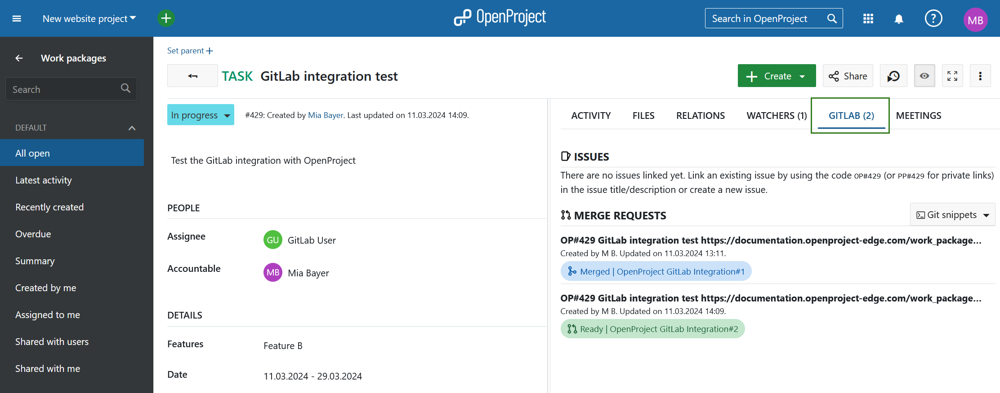

The tab shows all merge requests (MR) linked to a work package with the corresponding status (e.g. 'Ready' or 'Merged') as well as the state (e.g. 'success' or 'queued') of the GitLab actions configured to run for a MR. MRs and work packages are in an n:m relationship, so a work package can be linked to multiple merge requests and a merge request can be linked to multiple work packages.

Additionally, in your OpenProject work package, the GitLab integration supports you in creating a branch specific to the work package and consequently the matching merge request.

Merge request activities will also show up in the Activity tab when the merge request is

* first referenced (usually when opened)
* merged
* closed

## Configuration

You will first have to configure both OpenProject and GitLab for the integration to work.

### OpenProject

First you will need to create a user in OpenProject that has the permission to make comments. This role only requires two permissions, *View work packages* and *Add notes*, which you will find in the **Work packages and Gantt charts** section under  [**Roles and Permissions**](../../users-permissions/roles-permissions/).

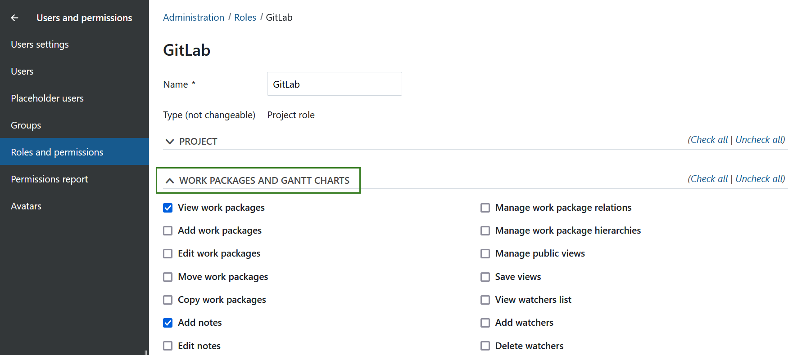

This user will then have to be **added to each project** with a role that allows them to see work packages and comment on them.

Once the user is created you need to generate an OpenProject API token for this user (you will need it on the GitLab side). For this you have to:

1. Login as the newly created user
2. Go to [My Account](../../../getting-started/my-account/) (click on the Avatar in the top right corner and select *My account*)
3. Go to [*Access Tokens*](../../../getting-started/my-account/#access-tokens)
4. Click on **+ API token**

> Make sure you copy the generated key and securely save it, as you will not be able to retrieve it later.

You can then configure the necessary webhook in [GitLab](#gitlab).

Finally you will need to activate the GitLab module under [Project settings](../../../user-guide/projects/project-settings/modules/) so that all information pulling through from GitLab will be shown in the work packages.

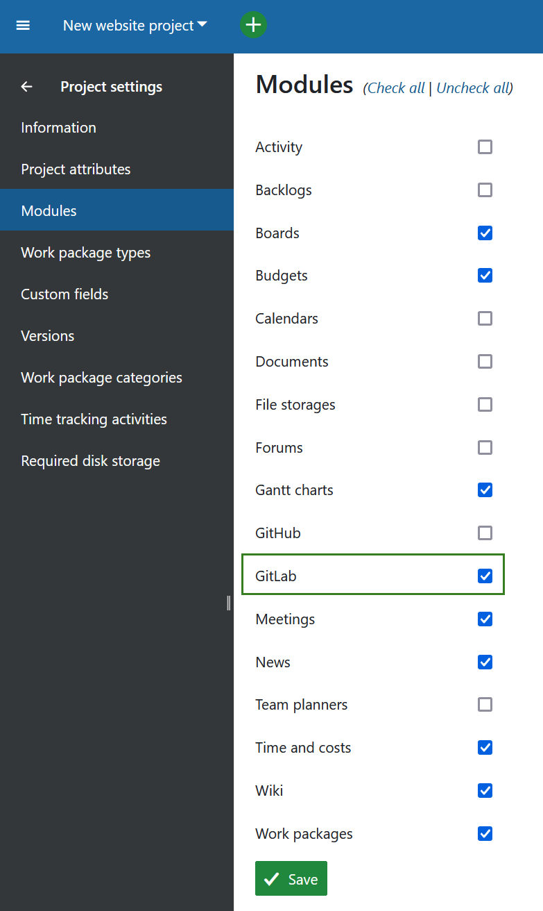

Seeing the **GitLab** tab requires **Show GitLab content** permission, so this permission needs to be granted to all roles in a project allowed to see the tab.

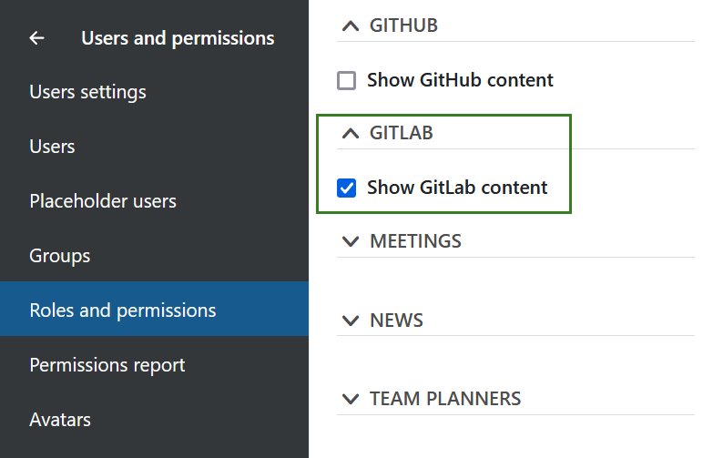

### GitLab

In GitLab you have to set up a webhook in each repository to be integrated with OpenProject. For that navigate to **Settings** -> **Webhooks** and click on **Add new webhook**.

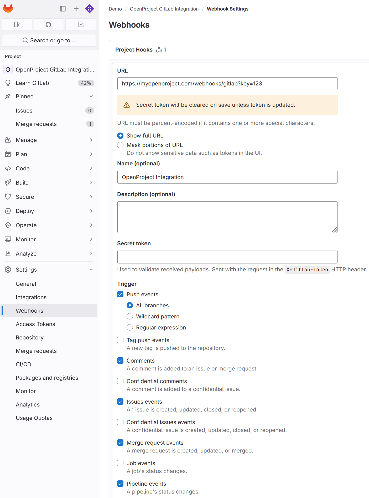

You need to configure the **URL** . It must point to your OpenProject server's GitLab webhook endpoint (`/webhooks/gitlab`).

You will need the API key you copied earlier in OpenProject. Append it to the *URL* as a simple GET parameter named `key`. In the end the URL should look something like this:

`https://myopenproject.com/webhooks/gitlab?key=4221687468163843`

> **Note**: For the events that should be triggered by the webhook, please select the following
>
> - Push events (all branches)
> - Comments
> - Issues events
> - Merge request events
> - Pipeline events

> **Note**: If you are in a local network you might need to allow requests to the local network in your GitLab instance.  
> You can find this settings in the **Outbound requests** section when you navigate to **Admin area -> Settings -> Network**.

We recommend that you enable the **SSL verification** before you **Add webhook**.

Now the integration is set up on both sides and you can use it.

## Using GitLab integration

### Create merge requests

As merge requests are based on branches, a new branch needs to be created first. For that, open the GitLab tab in your OpenProject work package detailed view. Click on **Git snippets** to extend the menu. First, copy the branch name by clicking the corresponding button.

Then, open your git client, e.g. Git desktop client or a console. There, you can create your branch by entering the branch name you copied from your OpenProject work package. That way, all the branches will follow a common pattern and as the OpenProject ID is included in the branch name, it will be easy to see the connection between a MR and a work package when taking a look at a list of MRs on GitLab.

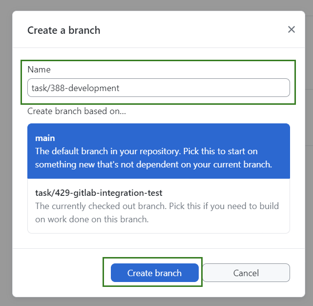

You can now publish your branch (you can also do this later, after making the changes and before opening a merge request).

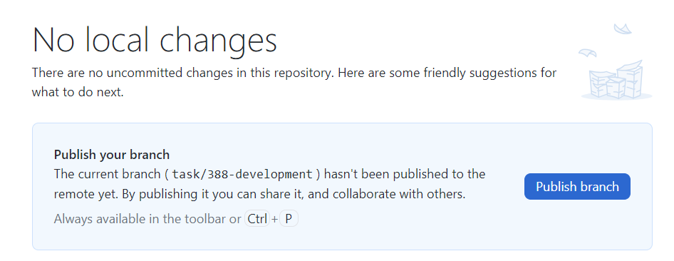

With the branch opened, you can start the actual development work using your preferred tool to alter your codebase.

Once you are satisfied with the changes you can create a commit. Within the 'Git snippets' menu, OpenProject suggests a commit message for you based on the title and the URL of the work package.

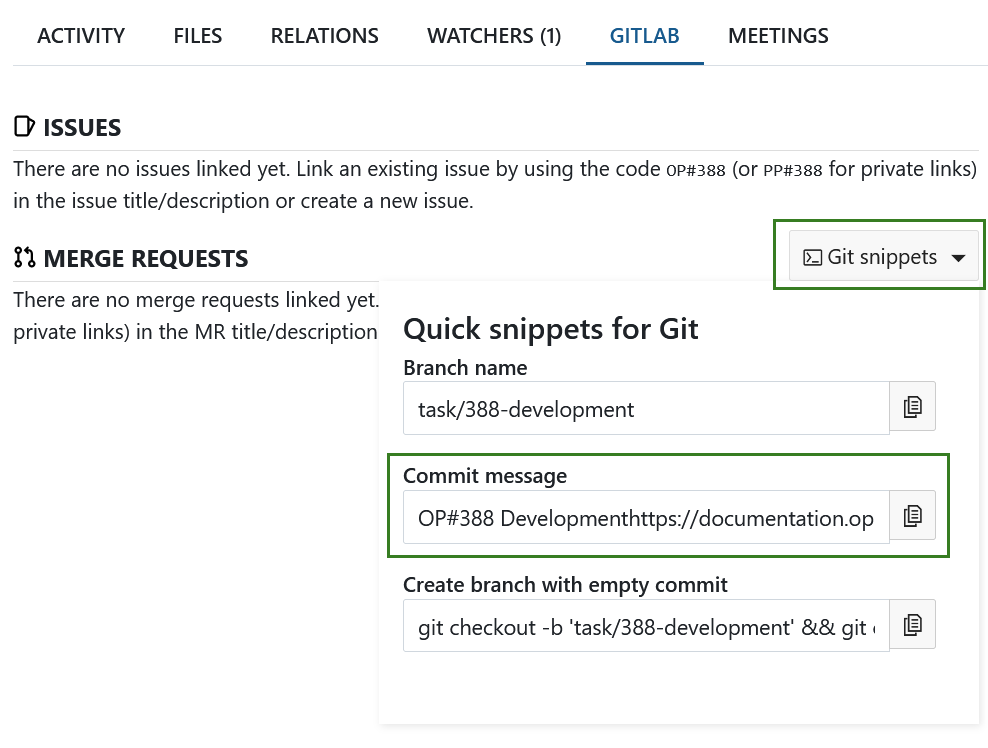

A URL pointing to a work package in the merge request description or a comment will link the two. The link needs to be in the MR and not in a commit, but GitLab will use the first commit message as the proposed branch description (as long as there is only one commit). Alternatively you can also use 'OP#' as a work package reference in an issue or a MR title, in this case "OP#388", where 388 is the ID of the work package.

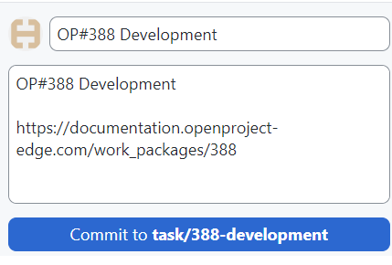

Once the changes are made, you can create your merge request. Title and comment with the link to the respective OpenProject work package will be prefilled, at least if there is only one commit to the branch. Because of this one commit limitation and if the policy is to create a branch as early as possible, there is a third option in the 'Git snippets' menu ('Create branch with empty commit') that will open a branch and add an empty commit to it in one command. Using this option, one can first create the branch quickly and have it linked to the work package right from the beginning. Commits can of course be added to the branch (and PR) after that.

The branch description can be amended before a MR is created giving the opportunity to further describe the changes. To help with that, it is also possible to copy parts of the work package description since the description can be displayed in the markdown format. Links to additional work packages can also be included in the MR description.

If you use OP# as a reference in an Issue or MR title, all comments will be replicated in OpenProject. However, sometimes you may only want to keep information about the status of an Issue/MR in OpenProject without your comments being published. In this case, you can use "PP#" as a reference. For example "PR#388".  This way the comments will not be published in OpenProject. If you only want to publish one of the comments from a private Issue/MR, you can use "OP#" directly in that comment. This way only that specific comment will be published in OpenProject, but the rest of the comments will remain private. [Read more](https://github.com/btey/openproject-gitlab-integration?tab=readme-ov-file#difference-between-op-and-pp).

Click on **Create merge request** and your merge request will be opened.

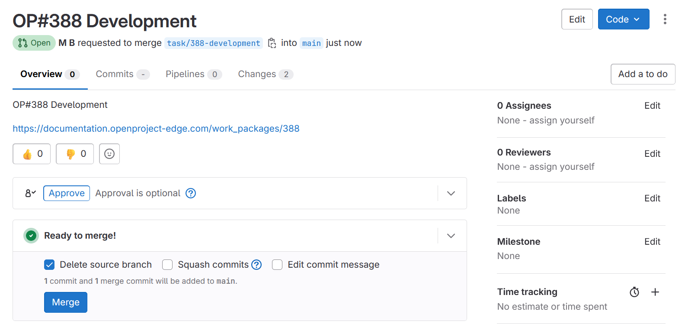

When you click on the link in the comment, it will take you to the OpenProject work package, where you will see in the Activity tab of the work package that the merge request was created.

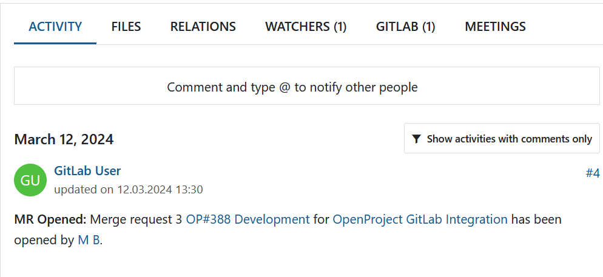

In the GitLab tab of that work package, the status of the merge request as well as status of all the configured GitLab Actions will also be displayed.

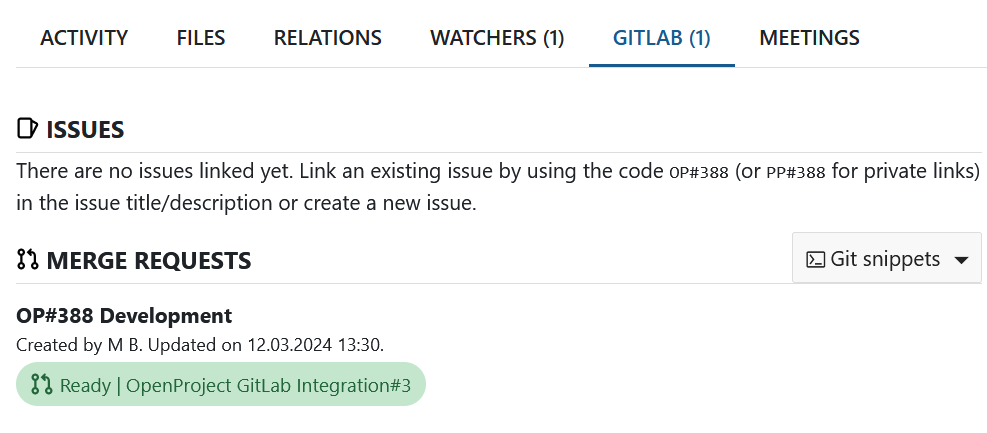

If the status of a merge request changes, it will be reflected in the OpenProject work package accordingly. Please see the example below.

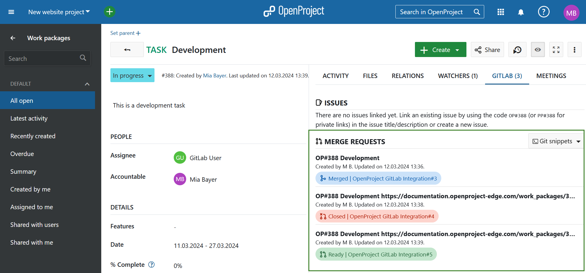

### Link issues

OpenProject GitLab integration allows linking GitLab issues directly with OpenProject work packages.

Initially when no issues were linked yet you will see the following message under **GitLab** tab.

You can either create a new issue in GitLab, or edit an already existing one. Enter the code **OP#388** into the issue title or description to create the link between the GitLab issue and the OpenProject work package. In this case 388 is the work package ID.

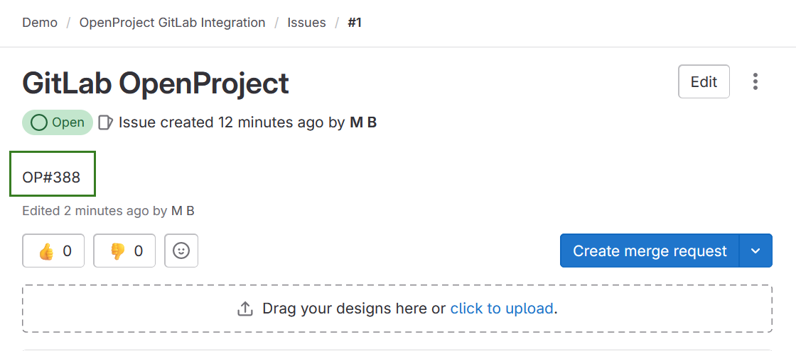

Once you save your changes or create a GitLab issue, it will become visible under the **GitLab** tab in OpenProject.

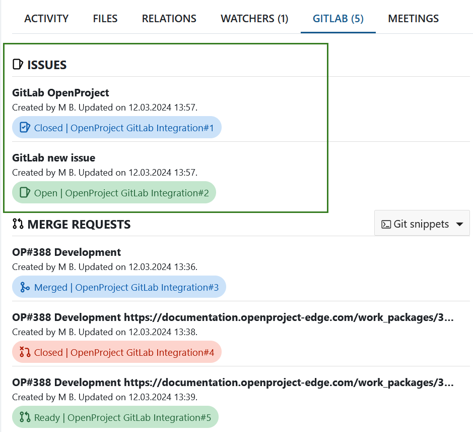
